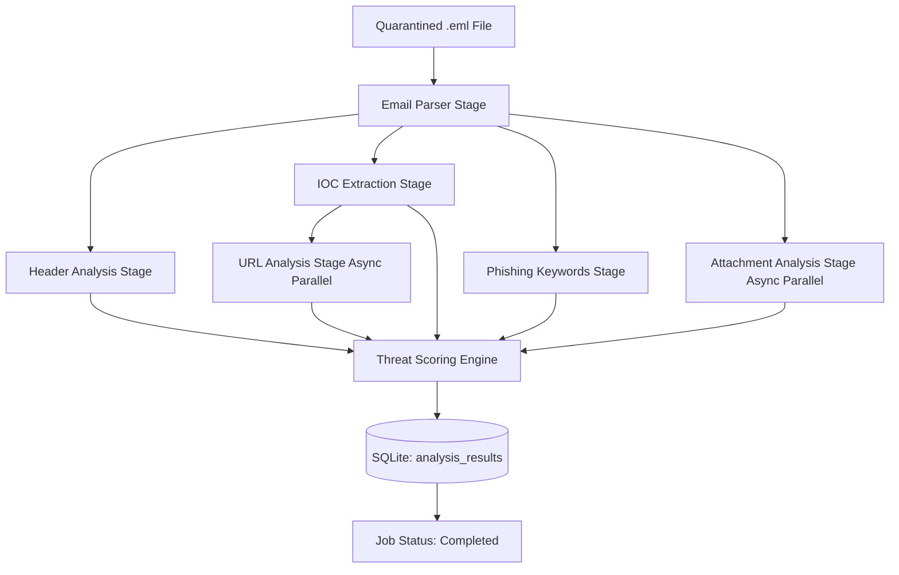

# DeepMail Analysis Pipeline

The Analysis Pipeline is the core intelligence engine of DeepMail. It is an asynchronous, multi-stage workflow designed to deconstruct an email, extract indicators of compromise (IOCs), analyse them against local caches and static heuristics, and compute a highly accurate Threat Score.

## Architecture & Data Flow

When a worker node picks up an email analysis job from the Redis Stream, the `run_pipeline` function in `mod.rs` orchestrates the following flow:

## Security & Concurrency Design

- **Non-blocking I/O**: We use `tokio::fs` and asynchronous Redis queries so the worker thread pool is never blocked on I/O.
- **Shared Cache State**: The pipeline uses an `Arc<Mutex<ThreatCache>>` to multiplex local cached intelligence lookups (IPs, domains, hashes) safely across concurrent pipeline executions.
- **Audit Trails**: Every stage transition is recorded in `job_progress`, and any failure halts the pipeline while writing exactly what went wrong into `audit_logs` and the `error_message` column.

## Module Index

1. [Email Parser](email_parser/README.md) - RFC 5322 extraction.
2. [Header Analysis](header_analysis/README.md) - SPF/DKIM/DMARC routing analysis.
3. [IOC Extractor](ioc_extractor/README.md) - Regex-based extraction of network and file indicators.
4. [Phishing Keywords](phishing_keywords/README.md) - Static body scanning for deceptive language.
5. [URL Analyzer](url_analyzer/README.md) - Heuristic structural domain analysis with Redis caching.
6. [Attachment Analyzer](attachment_analyzer/README.md) - Entropy and Magic byte MIME checking with hash lookups.
7. [Geo Intel](../geo_intel.rs) - MaxMind + Redis + SQLite TTL + AbuseIPDB IP enrichment.
8. [Threat Scoring](scoring/README.md) - 4-dimension weighted risk grading framework.

## Geo Intelligence Storage

- IP IOC metadata stores geolocation and enrichment fields as JSON in `ioc_nodes.metadata`.
- Canonical IP intel is persisted in SQLite table `ip_geo_intel` with TTL (`expires_at`).
- Redis keys (`deepmail:cache:ip:<ip>`) are used as hot cache for low-latency lookups.
